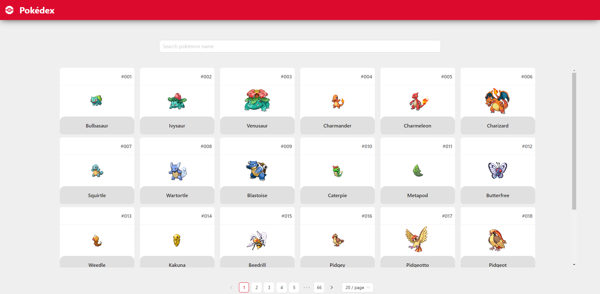
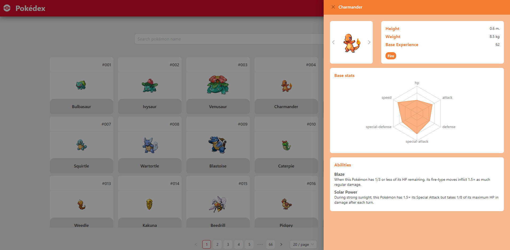

<h1 align="center">Pokédex</h1>

<p align="center">
  
</p>

> Conceptual project built as a coding challenge for a frontend position at [Looqbox](https://github.com/looqbox). A Single Page Application using ReactJS integrated to the [Pokéapi](https://pokeapi.co/docs/v2) that displays a list of Pokémons and their information.

---

## Screenshots


_Main dashboard_


_Pokémon information card_

## Technologies used

- [pnpm](https://pnpm.io/): Node package manager
- [Vite](https://vite.dev/guide/): Build tool to handle project building and development server;
- [AntDesign](https://ant.design/): Primary component library for building the interface;
- [Styled Components](https://styled-components.com/): CSS-in-JS library to extend AntDesign and customise components;
- [Tanstack Query](https://tanstack.com/): Asynchronous state management library to handle data fetching and caching;
- [React Router Dom](https://reactrouter.com/en/main): Library to handle client-side routing;
- [Axios](https://axios-http.com/docs/intro): Library to wrap HTTP requests;

## Running the project locally

1. Clone the project locally with git:

```bash
git clone https://github.com/silvestr3/looqbox-frontend-challenge
```

2. Install dependencies:

```bash
cd looqbox-frontend-challenge
pnpm install
```

3. Run development server:

```bash
pnpm dev
```

4. Access the development server at [http://localhost:5173/](http://localhost:5173/)
