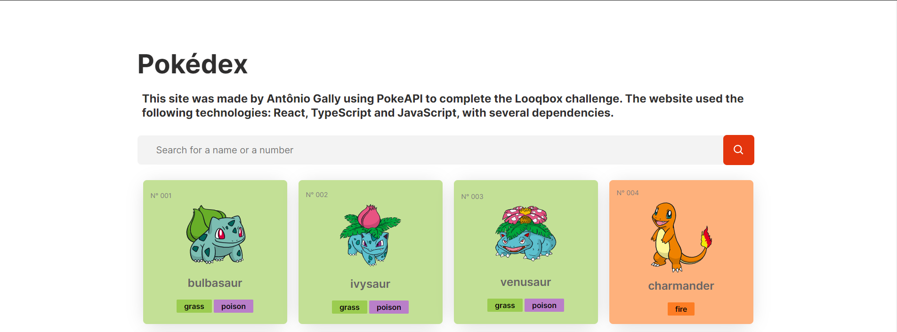
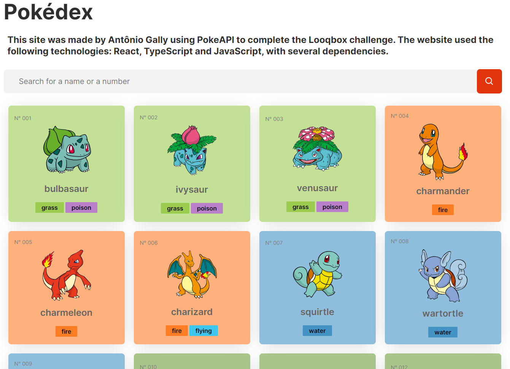
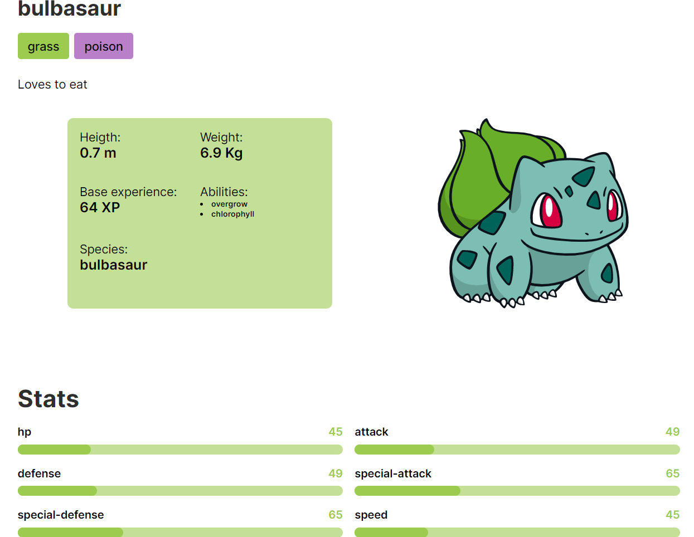

<p align="center">
  
  
  <a href="https://github.com/AntonioGally/looqbox-frontend-challenge/commits/master">
    
  </a>
   
   <a href="https://github.com/AntonioGally/looqbox-frontend-challenge/stargazers">
    
  </a>
</p>

<h1 align="center">
    
</h1>

<p align="center">
 <a href="#-sobre-o-projeto">Sobre</a> •
 <a href="#-funcionalidades">Funcionalidades</a> •
 <a href="#-layout">Layout</a> • 
 <a href="#-como-executar-o-projeto">Como executar</a> • 
 <a href="#-tecnologias">Tecnologias</a> • 
 <a href="#-autor">Autor</a> • 
 <a href="https://antoniogally-pokedex.netlify.app/#/">Demo</a>
</p>

## 💻 Sobre o projeto

Pokéxex é um projeto feito para o desafio da vaga de desenvolvedor frontend da empresa LooqBox, consiste em criar uma Pokédex do mundo Pokémon.

---

## ⚙️ Funcionalidades

- [x] List Page

  - [x] Lista de 20 em 20 pokémons
  - [x] Renderiza mais 20 pokémons quando o usuário clica no botão "Load More"
  - [x] Cada cartão do pokémon possuí informações sobre o tipo do pokémon, sendo identificado por cores e legendas

- [x] SearchBar

  - [x] Pesquisa pokemons na mesma tela de listagem
  - [x] Realiza a pesquisa do pokémon via ID ou nome

- [x] Information Page

  - [x] Informações sobre um pokémon específico
  - [x] Gráfico sobre habilidades que o pokémon selecionado possui
  - [x] Identificação visual do tipo do pokémon

---

## 🎨 Layout

### Prints

<p align="center" style="display: flex; align-items: flex-start; justify-content: center;">
  
</p>

<p align="center" style="display: flex; align-items: flex-start; justify-content: center;">
  
</p>

---

## 🚀 Como executar o projeto

### Pré-requisitos

Antes de começar, você vai precisar ter instalado em sua máquina as seguintes ferramentas:
[Git](https://git-scm.com), [Node.js](https://nodejs.org/en/).
Além disto é bom ter um editor para trabalhar com o código como [VSCode](https://code.visualstudio.com/)

#### 🧭 Rodando a aplicação web (Frontend)

```bash

# Clone este repositório
$ git clone https://github.com/AntonioGally/looqbox-frontend-challenge.git

# Acesse a pasta do projeto no seu terminal/cmd
$ cd looqbox-frontend-challenge

# Instale as dependências
$ yarn install

# Execute a aplicação em modo de desenvolvimento
$ yarn start

# A aplicação será aberta na porta:3000 - acesse http://localhost:3000

```

---

## 🛠 Tecnologias

As seguintes ferramentas foram usadas na construção do projeto:

#### **Website** ([React](https://reactjs.org/) + [TypeScript](https://www.typescriptlang.org/))

- **[React Router Dom](https://github.com/ReactTraining/react-router/tree/master/packages/react-router-dom)**
- **[Axios](https://github.com/axios/axios)**
- **[React Bootstrap](https://react-bootstrap.github.io)**
- **[Styled Components](https://styled-components.com)**
- **[Styled Icons](https://styled-icons.js.org)**
- **[React Form Hook](https://react-hook-form.com)**

> Veja o arquivo [package.json](https://github.com/AntonioGally/looqbox-frontend-challenge/blob/production/package.json)

## 🦸 Autor

<a href="https://www.antoniogally.tk/#/">
 
 <br />
 <br />

---
