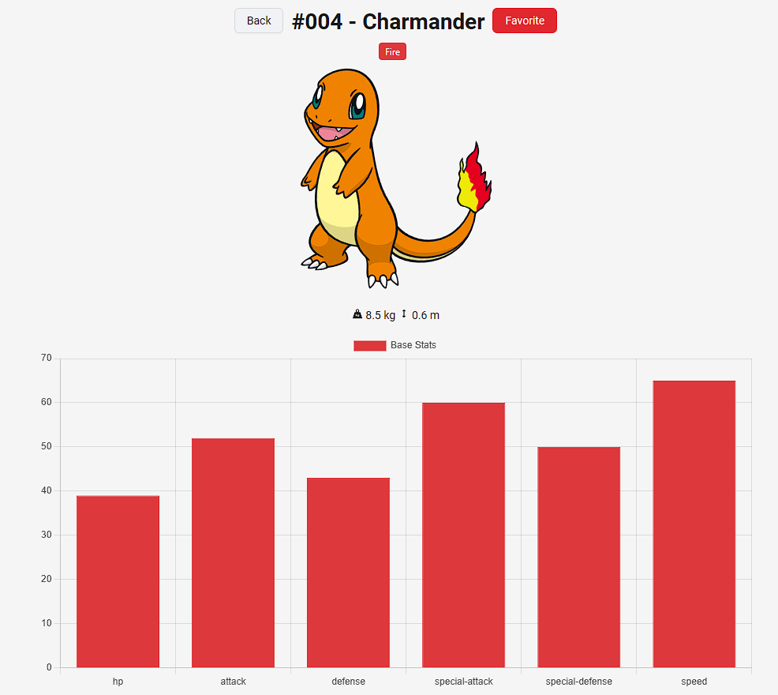
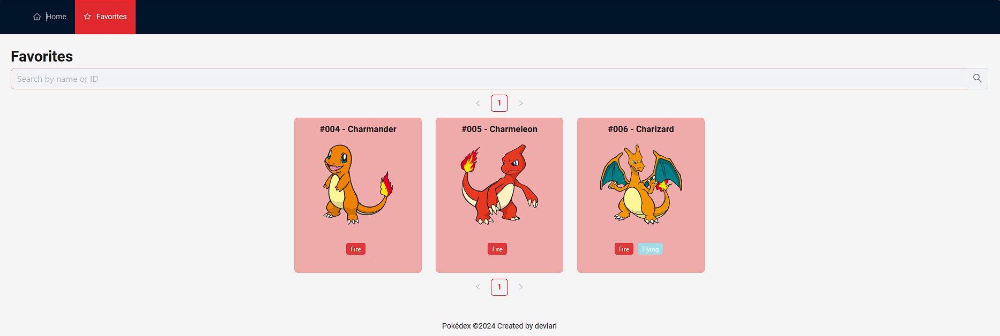

 <h1> Pokédex </h1>
  
   
   
 <a href="#-sobre">Sobre</a> •
 <a href="#-tecnologias">Tecnologias</a> • 
 <a href="#-layout">Layout</a> • 
 <a href="#-autora">Autora</a>

---

## 💾 Sobre

  
A Pokédex é um website interativo que consome a PokeAPI para exibir informações detalhadas sobre todos os pokémon. Feita para o desafio Looqbox de front-end.

---

## 🛠 Tecnologias

  
As seguintes ferramentas foram usadas na construção do website:

  <ul>
    <li> 
      <a href="https://www.typescriptlang.org/">Typescript</a>
    </li>
    <li>
      <a href="https://nextjs.org/">Next.js</a>
    </li>
    <li>
      <a href="https://axios-http.com/ptbr/">Axios</a>
    </li>
    <li>
      <a href="https://redux.js.org/">Redux</a>
    </li>
    <li>
      <a href="https://ant.design/">Ant design</a>
    </li>
   <li>
     <a href="https://www.chartjs.org/">Chart.js</a>
   </li>
  </ul>

---

## 🎨 Layout

  
  
  

---

## 👩🏻‍💻 Autora

---

 
 
