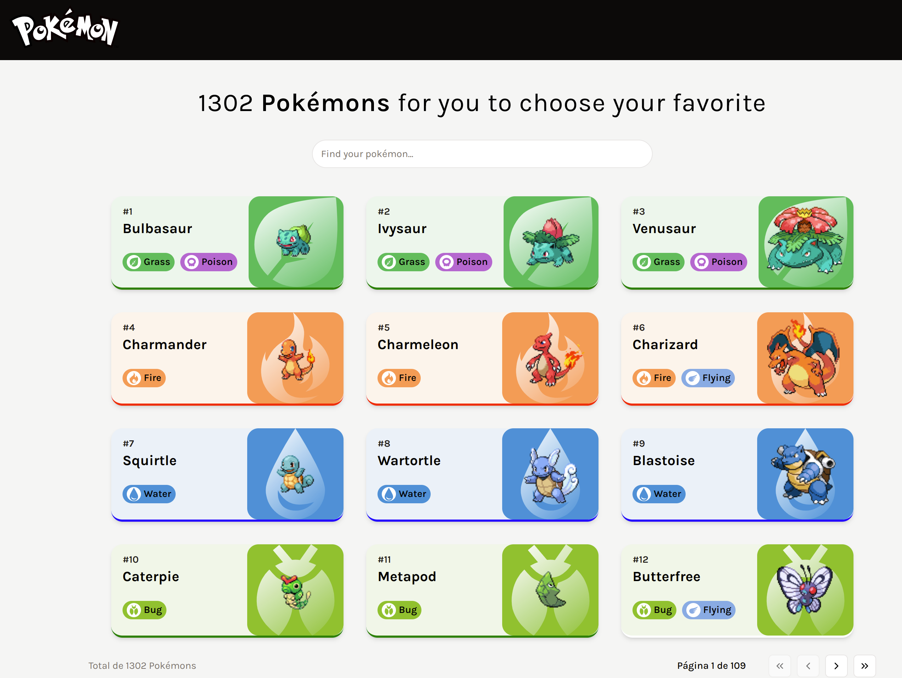
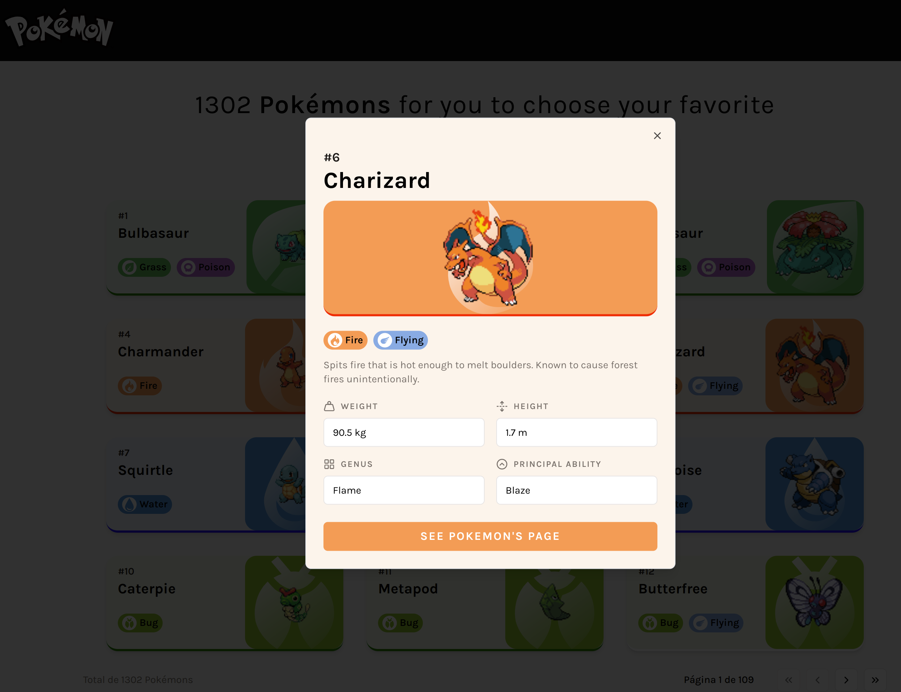
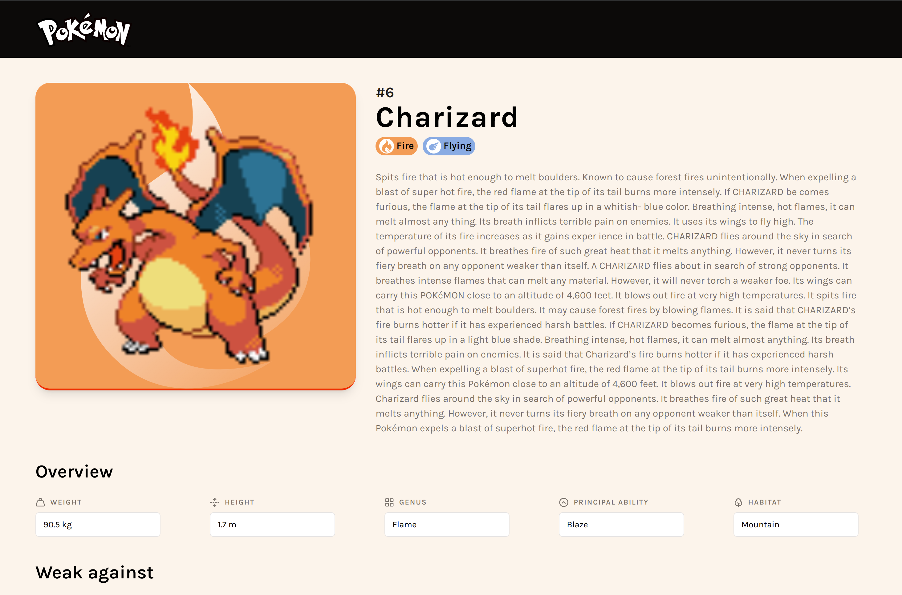
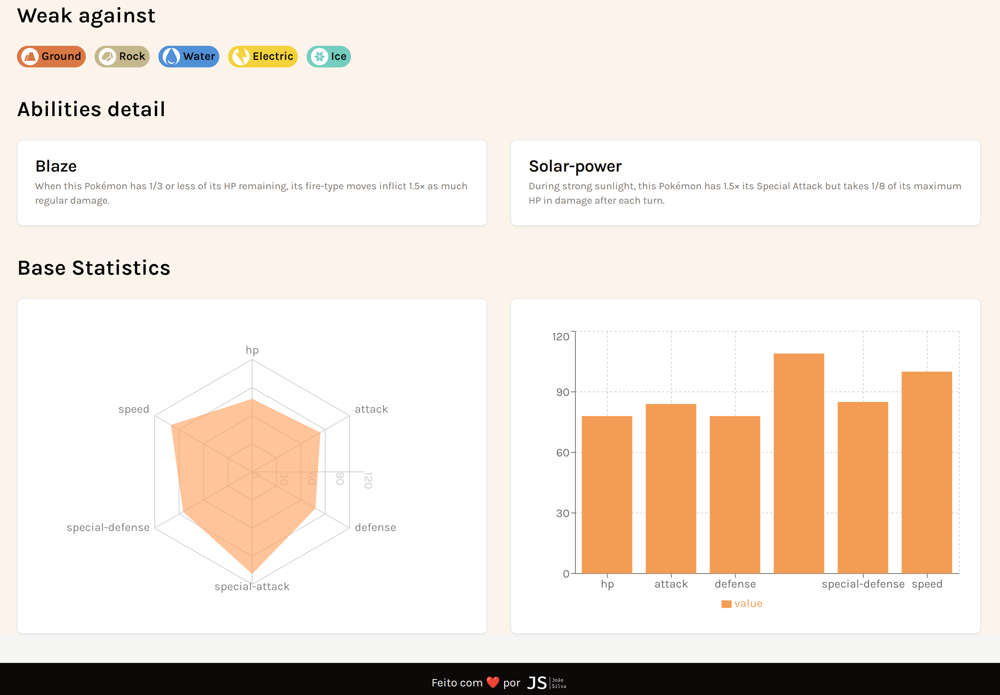
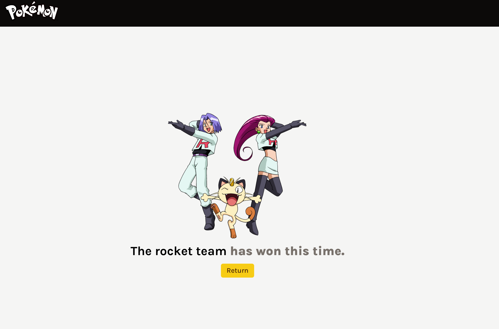

# PokeWiki

Bem-vindo(a) ao PokeWiki, um projeto de listagem de Pokémons. Nesse projeto é possível navegar e procurar por diversos Pokémons da [PokéApi](https://punkapi.com/documentation/v2). 

Esse projeto faz parte do desafio proposto pela LooqBox, utilizando ReactJS.

## Screenshots

<p align="center">
  
</p>

<p align="center">
  
</p>

<p align="center">
  
</p>

<p align="center">
  
</p>

<p align="center">
  
</p>


## 🚀 Principais Funcionalidades

- Listagem de Pokémons sob demanda, utilizando recursos de paginação;
- Busca pelo nome dos Pokémons;
- Tela de detalhes de cada Pokémon

## ☑️ Tarefas implementadas

- [X] Na página principal, precisa de uma barra de pesquisa e uma lista carregada de pokémons (aleatórios ou apenas codificados)
- [X] Ao clicar em qualquer pokémon, mostra um cartão/modal/página com as informações desse pokémon
- [X] Pesquisar e pressionar Enter na barra de pesquisa mostrará o resultado em vez da lista
- [X] Seu app precisa de pelo menos duas rotas diferentes (/home /more por exemplo -> seja criativo!)
- [X] Documentação
- [X] Linting
- [X] Gráficos

## ⚠️ Requisitos para a instalação
```
## Para ver a versão do node:
node -v
```

[Como instalar o node em qualquer sistema operacional](https://efficient-sloth-d85.notion.site/Instalando-o-Node-js-d40fdabe8f0a491eb33b85da93d90a2f)


## 👣 Passo a passo para rodar o projeto em sua máquina

1 - Para clonar o projeto:
```
git clone git@github.com:joaoD3V/looqbox-frontend-challenge.git
```

2 - Entrar na branch usada para o desenvolvimento:
```
git checkout poke-challenge
```

3 - Para instalar as dependências do projeto:
```
npm install
```
4 - Para rodar o projeto:
```
npm run dev
```

---

Feito com ♥ by joaoD3V