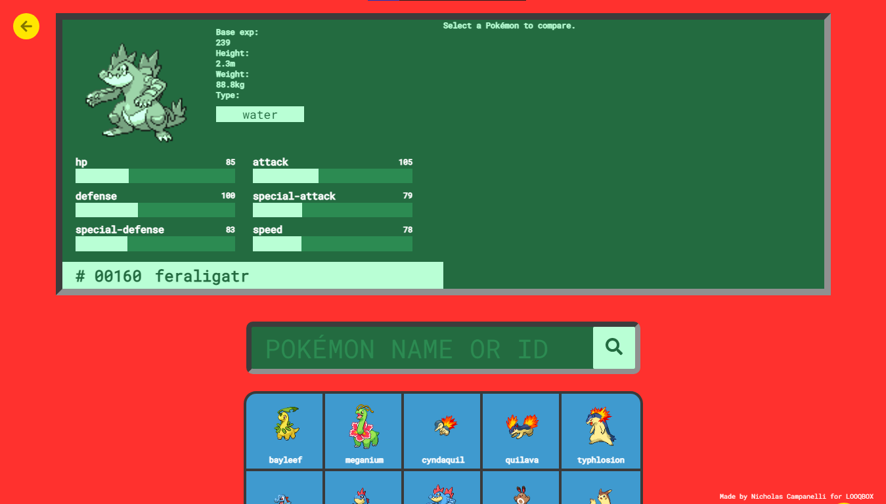
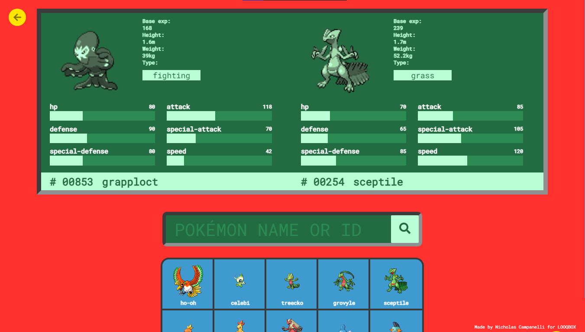
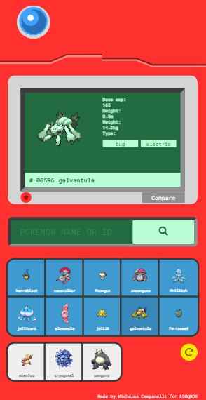
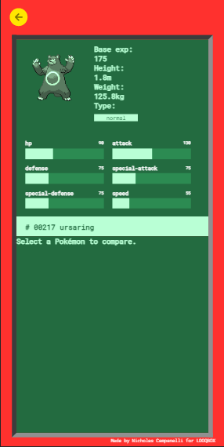
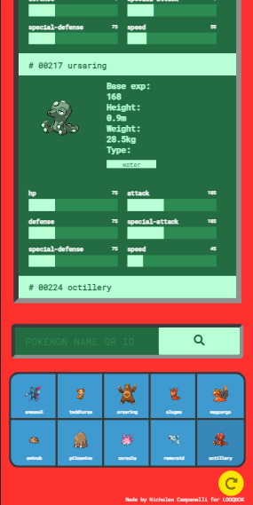

<p align="center">
    
    <h1 align="center">Pokédex</h1>
    <h6 align="center">by Nicholas Campanelli</h6>
</p>

---

Pokédex is a web application made to search, visualize and compare POKéMON while having the real pokédex experience.

---

## 📷 Gallery
<div style="width: 100%; display: flexbox; flex-flow: row wrap;">






</div>

## 🎈 Features

With Pokédex you can:

- Find some random POKéMON at the home page.
- Search a specific POKéMON.
- Click on the POKéMON to view their specs.
- Add POKéMON to your main lineup by clicking the red button.
- Compare POKéMON to view their stats.
- Search POKéMON to compare.

It is possible to use Pokédex on any device, since Pokédex was made to be responsive and scalable.

## 🏃‍♂️ How to Run

First you'll need a few things to be able to run Pokédex on your machine:

- Git version control software installed.
- Latest version of NodeJS installed.
- 312mb available on the disk.
- A web browser with JavaScript enabled.

And then, just follow these steps:

- Open your command shell (Windows Powershell or CMD) and clone this repository with Git:
```
git clone https://github.com/niccampanelli/looqbox-frontend-challenge.git

```

- After it gets downloaded, you'll have to install the dependencies. First, open the project directory:
```

cd looqbox-frontend-challenge

```

- And then run:
```

npm install

```

- After it's done, just run
```

npm start

```

- And the app will be opened on your default web browser. You can access it via any device you want by opening it's address:
```

<your_computer_ip>:3000

```

## 💡 Technologies

The following technologies and libraries were used in this project:

- NodeJS
- npm
- ReactJS
- Axios
- React Router DOM
- React Icons
- PokéAPI
