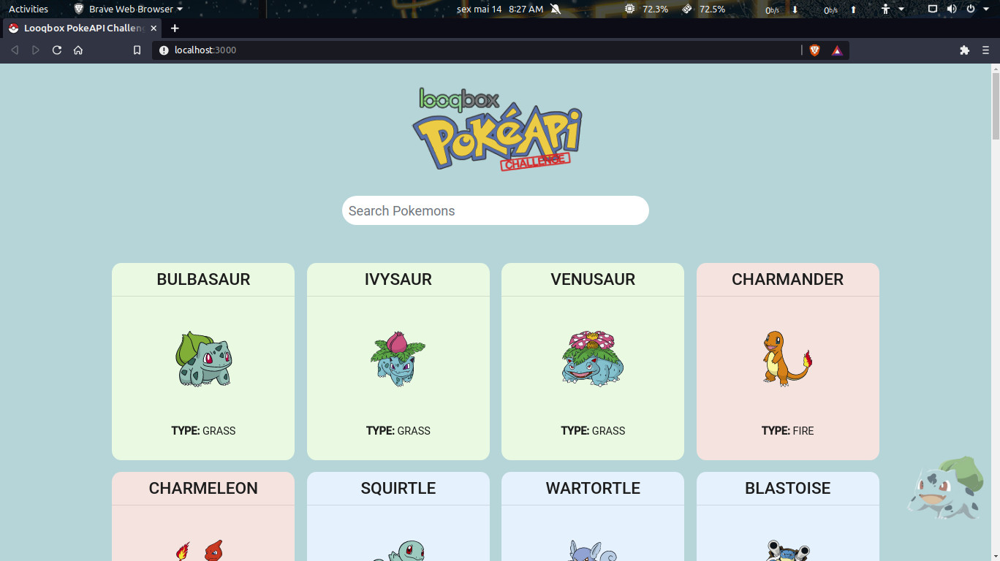
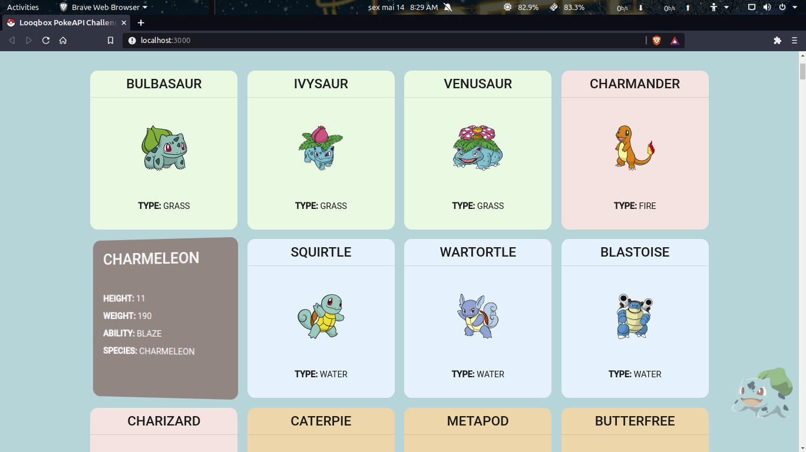
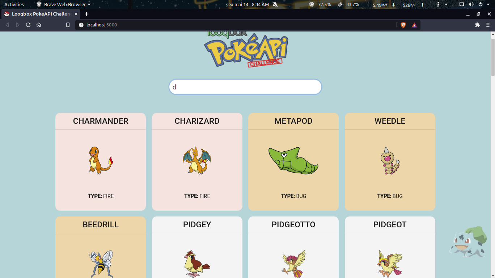

## Starting the project
- The project only needs to be installed YARN

- SPA project containing the components:
- App.js
	- Here is the homepage of the application, where it contains the main imports of components, it also contains the states of Search, Current Page, Next Page, Pokemons and Loading.
	- to be more specific:
	- the constant:
		- (searchTerm and setSearchTerm) are used to obtain the value entered by the user in the search bar, when we type we store this event through the constant (HandleChange)
		- (searchResults, setSearchResults) returns pokemons in a filtered way according to the search
		- (currentPageUrl, setCurrentPageUrl) is where the website's current url is stored
        (nextPage, setNextPage) loads more data
		- (pokemons, setPokemons) returns us the list of API Pokémon
		- (isLoading, setIsLoading) are just to check if the API is loading and returns a loading gif

	- inside Hook (useEffect) 
		- (fetchPokemons) is an asynchronous function that consumes the data from the current API url and returns a JSON, through the function 			(createPokemonObject) we pass this JSON to an object and store the value in the constant state (pokemons)
		- the constant (NextPage) aims to load more data
		- still inside Hook, the function (results) is used to filter the results according to the entered value then we store the values ​​in an array
		- still within App.js, it renders the following components: (Header, Search, PokemonGrid, PagesButtons)

- About the components, I stored all of them in an organized way, each with its folder containing the JSX file and its CSS styling
	- Header
		- This is basically where the website logo is located, it takes an svg file inside the Assets folder
	- Search
		- The input receives the value entered by the user in the search bar
	- Spinner
		- This component is just a loading GIF
	- PokemonItem
		- This component is very important, it is each card shown on the screen, it consumes the data of the Pokemon through the Prop called (pokemon), it renders on the front the name of the Pokemon, the image and says what is the type, in its the back it shows the name, height, weight, skill and species, it is important to mention that it contains some specific stylizations passed within the fragment itself
	- PokemonGrid
		- This component assembles the grid of the cards
	- PagesButton
		- That's just one button to load more items on the screen

- The images contained in the application are inside the Assets folder

- This project contains Bootstrap and the Roboto font

# Some screenshots os the Project

