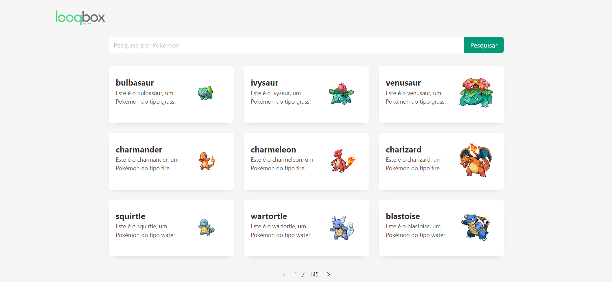
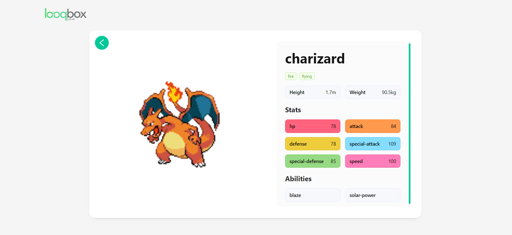

# Pokédex - Looqbox

Projeto desenvolvido para vaga de estágio em front-end na Looqbox. A Pokedex foi criada utilizando ReactJS com TypeScript, Ant Design para a interface e Redux para o gerenciamento de estado. A aplicação consome dados de uma API pública, permitindo listar Pokémon, realizar buscas, navegar entre páginas e visualizar detalhes como habilidades e tipos. 


## Screenshots





## Funcionalidades

- Busca de dados na PokeAPI
- Exibição da Lista de Pokémons
- Filtragem da lista atraves de um Search
- Tela que exibe detalhes do Pokemon selecionado


## Instalação

Instale e rode meu projeto na sua maquina

```bash
  git clone -repo
  cd looqbox-frontend-challenge
  npm install
  npm run dev
```

    
## Aprendizados

Construir essa Pokédex me ensinou bastante sobre Redux e Ant Design. Aprendi a gerenciar o estado da aplicação de forma centralizada utilizando a Store do Redux, o que tornou mais fácil controlar e compartilhar dados entre os componentes. Também me aprofundei no uso de componentes do Ant Design, como Layout, Content, Tag, Search e Pagination, que ajudaram a criar uma interface mais eficiente e organizada. Um dos desafios foi integrar esses recursos de forma coesa e garantir uma boa performance, algo que consegui superar implementando uma lógica de estado bem estruturada e uma navegação fluida.


## Feedback

Se você tiver algum feedback, por favor me deixe saber por meio de dayadiazprofisional@gmail.com


## Autores

- [@daya-diaz](https://www.github.com/daya-diaz)

