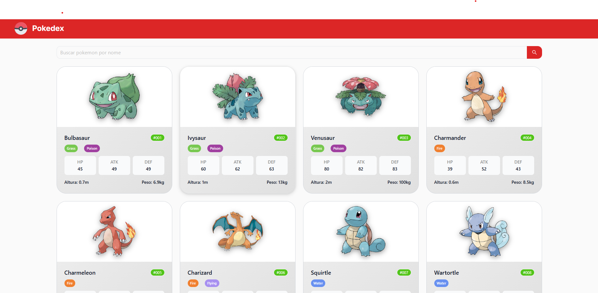
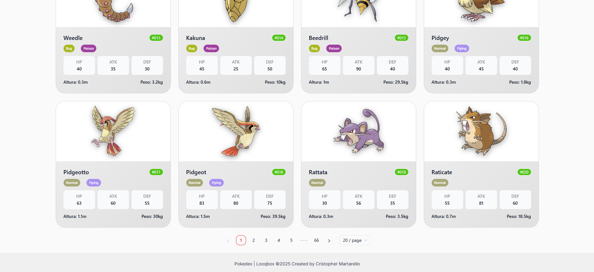
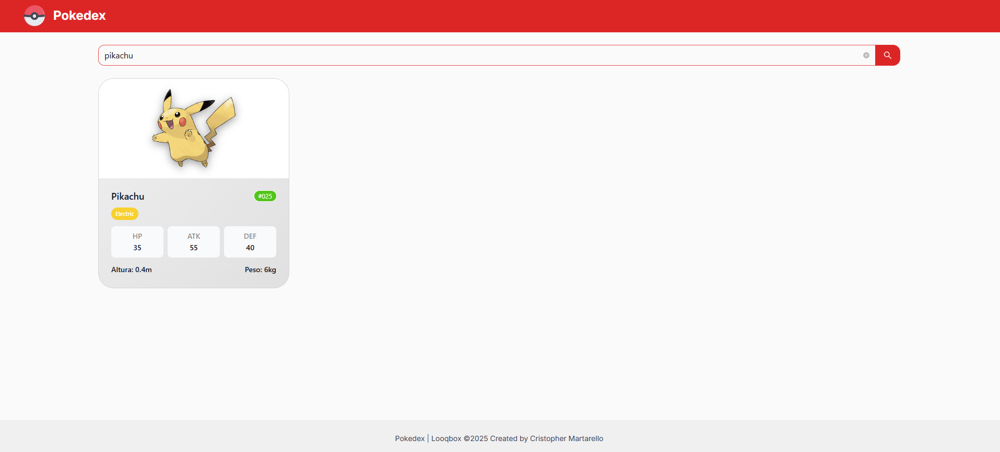
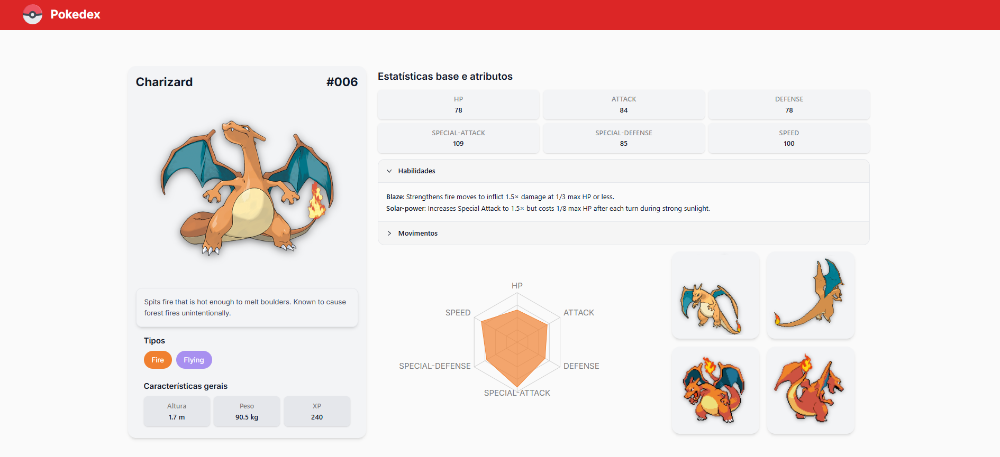
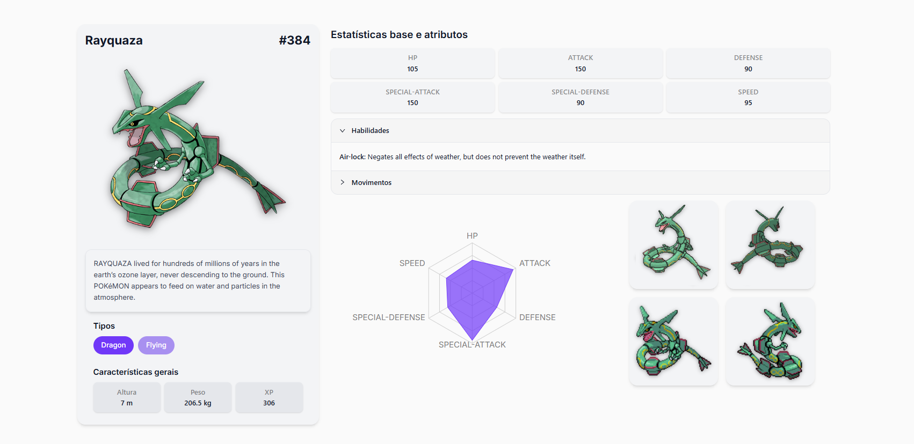

# Looqbox FrontEnd Challenge | Pokedex

## Descrição do Projeto

Este projeto foi desenvolvido como solução para o **Looqbox Frontend Challenge**, utilizando a [PokeAPI](https://pokeapi.co/).  
A aplicação é uma **Single Page Application (SPA)** em React que permite listar e buscar Pokémon, além de visualizar informações detalhadas sobre cada um.

## Screenshots


Página Home - Listagem de Pokemons


Página Home - Paginação


Página Home - Pesquisa de Pokemon


Página Details - Detalhes do Pokemon (Charizard)


Página Details - Detalhes do Pokemon (Rayquaza)

## Stack de Tecnologias

- [React](https://react.dev/) – Biblioteca principal para construção da interface da aplicação.
- [TypeScript](https://www.typescriptlang.org/) – Superset do JavaScript que adiciona tipagem estática.
- [Vite](https://vite.dev/guide/) – Ferramenta de build e desenvolvimento rápido.
- [React Router](https://reactrouter.com/) – Gerenciamento de rotas da aplicação.
- [React Tanstack Query](https://tanstack.com/query/latest) – Controle de cache, requisições e estados assíncronos.
- [Ant Design](https://ant.design/) – Biblioteca de componentes UI para estilização e usabilidade.
- [Recharts](https://recharts.org/) – Biblioteca para gráficos, utilizada na exibição de estatísticas base dos Pokémons.
- [Vitest](https://vitest.dev/) – Framework de testes unitários, integrado ao Vite.
- [Tailwind CSS](https://tailwindcss.com/) – Framework de classes CSS para estilização rápida e responsiva.

## Rodando o projeto local

1. Clone o projeto em sua máquina com o Git:

```bash
git clone https://github.com/CristopherMartarello/looqbox-frontend-challenge.git
```

2. Entre na branch feature/pokedex para acessar o desafio:

```bash
cd looqbox-frontend-challenge
git checkout feature/pokedex
```

3. Instale as dependências necessárias:

```bash
npm install
```

4. Rode o projeto em modo desenvolvimento:

```bash
npm run dev
```

5. Acesse o projeto em [http://localhost:5173/](http://localhost:5173/)

## Testes Unitários

Para rodar os testes unitários, utilize:

```bash
npm run test
```
