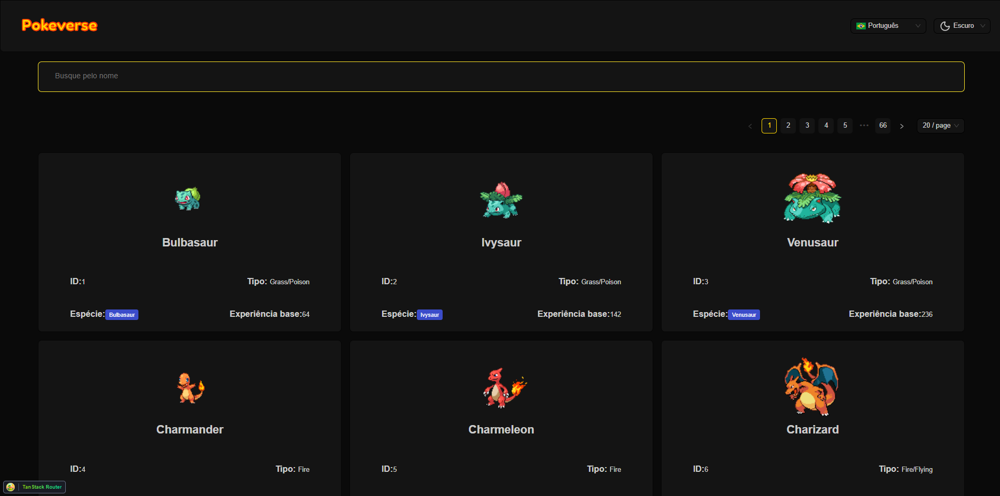
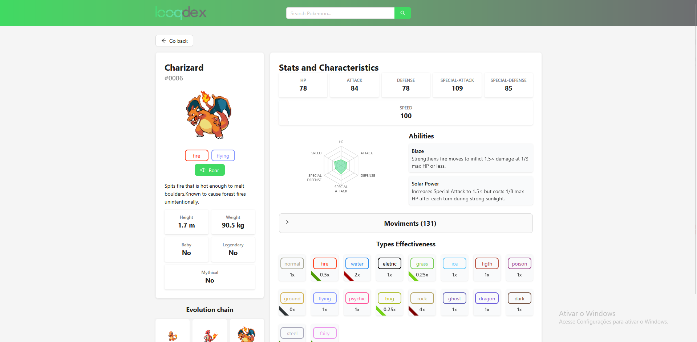
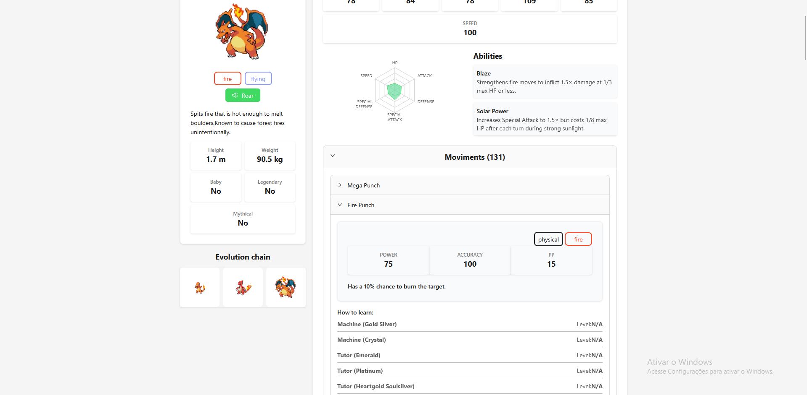

# Pokedex Challenge

## 📌 Project Summary

This project was developed as a solution for the **Frontend Challenge**, using the [PokeAPI](https://pokeapi.co/).  
The application is a **Single Page Application (SPA)** built with **ReactJS** that allows users to list and search for Pokémon, as well as view detailed information about each one.

---

## 📸 Screenshots

### Home Page (`/`)

Displays the initial list of Pokémon and a search bar.  


### Pokémon Details (`/pokemon/:id`)

Shows detailed information about a selected Pokémon.  
  


---

## 🛠 Technologies Used

- ⚡ [Vite](https://vitejs.dev/)
- ⚛️ [React](https://reactjs.org/)
- 🔄 [React Query](https://tanstack.com/query/latest) – Asynchronous state management
- 🎨 [Ant Design](https://ant.design/) – UI components
- 🎨 [TailwindCSS](https://tailwindcss.com/) – Utility-first styling
- 📊 [Recharts](https://recharts.org/) – Charts and data visualization
- 🧪 [Vitest](https://vitest.dev/) – Unit testing
- 🟦 TypeScript – Static typing for safer code

---

## 📂 Features

- 🔍 Search for Pokémon by name
- 📋 Initial Pokémon listing with dynamic loading
- 📄 Detail page with individual information
- 🛣️ Routes for `/` and `/pokemon/:id`
- ✅ Dynamic SPA (no page reload)

### ⭐ Additional Implemented Features (Bonus)

- 🔢 Pagination
- ⚠️ Error handling
- 🧪 Unit tests with coverage
- 🎨 Enhanced UI with **Ant Design**
- 📊 Data visualization with **Recharts**
- ⚠️ Linting

---

## 🖥️ How to Run the Project Locally

1. Clone this repository:

   ```bash
   git clone https://github.com/rodrigoacm10/looqbox-frontend-challenge
   ```

2. Checkout the pokedex branch:

   ```bash
   git checkout pokedex
   ```

3. Install dependencies:

   ```bash
   npm install
   ```

4. Run the project:
   ```bash
   npm run dev
   ```

## 🖥️ Running Tests

To run unit tests:

```bash
npm run test
```

To run tests with coverage:

```bash
npm run coverage
```
