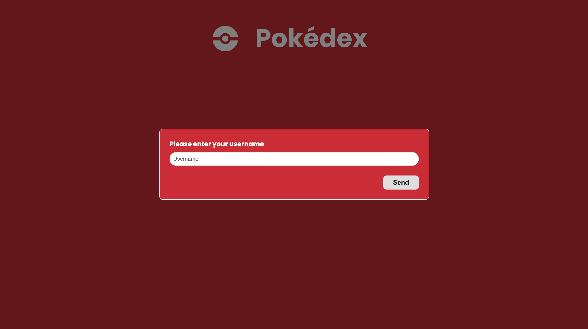

# A simple Pokedéx made in React.JS

# Pokedéx

# Access it now via the link below
## [Access Pokedex](https://looqbox-frontend-challenge-kappa.vercel.app/favorite-pokemons)

<p>
  
  
  
</p>

## Topics

[Technologies and tools](#technologies-and-tools)

[Installation and use](#installation-and-use)

<br>

## Technologies and tools

The following technologies were used in the development of the project:

- [React.JS](https://pt-br.reactjs.org/)
- [Typescript](https://www.typescriptlang.org/)
- [styled-components](https://styled-components.com/)
- [Redux](https://redux.js.org/)
- [React Query](https://tanstack.com/query/v3/)

<br>

## Installation and use

To run the application, you need to install the [Node](https://nodejs.org/en/)

Follow the steps below:

```bash
# Open a terminal and copy this repository with the command
$ git clone https://github.com/vitorSantanaDev/looqbox-frontend-challenge.git
# or use the download option.

# Enter the folder with
$ cd looqbox-frontend-challenge

# Create an .env file in the root of the project, add the same variable as in the env.example
# and add the url below as a value
$ https://pokeapi.co/api/v2/

# Install the dependencies
$ yarn install

# Run the application
$ yarn start
```

<br>

## How to use.

📃 In the screenshot below we have the login screen, where there is a simple simulation of login with just a username of your choice.
<br>



<br>

<br>

📃 In the screenshot below we have the home, where there is a list of pokemons. In the Header of the screen there is a text filter, sorting by alphabetical order or pokemon number.
<br>


<br>

📃 On the pokemon card you can see some of its information, such as its name and ID. There are also two actions you can do on this card, which are to add the pokemon to your list of favorite pokemons and to see its details.
<br>


<br>

<br>

📃 By clicking on view details on the pokemon's card, you will be taken to another screen where you can view more detailed information about the pokemon.
<br>


<br>

<br>

📃 By clicking on your username, a pop-up will appear containing the action to log out and navigate to the Favorite Pokémons, where it will be possible to view the pokemons that have been marked as favorites by clicking on the heart icon on the pokemon's card.
<br>


<br>


<br>

📃 You can return to Home by performing the same action you did to access the favorite pokemons screen.

<br>


---

Feito com :technologist: by [Vitor_Santana](https://github.com/vitorSantanaDev)

[](https://www.linkedin.com/in/vitor-santana-bbb607217/)
[](mailto:vitorsantana.developer@gmail)
