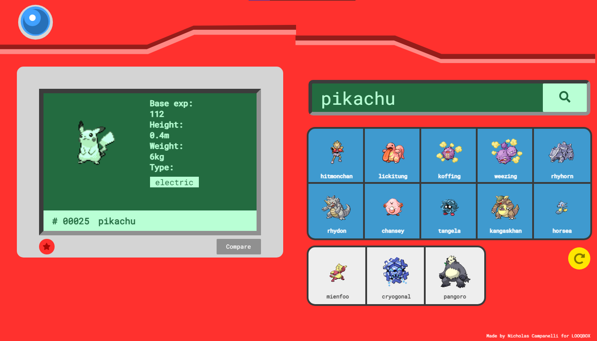

    
    <h1 align="center">Pokédex</h1>
    <h6 align="center">by Nicholas Campanelli</h6>

---

Pokédex is a web app made to search, visualize and compare POKéMON while having the real pokédex experience.

---

## 📷 Gallery

